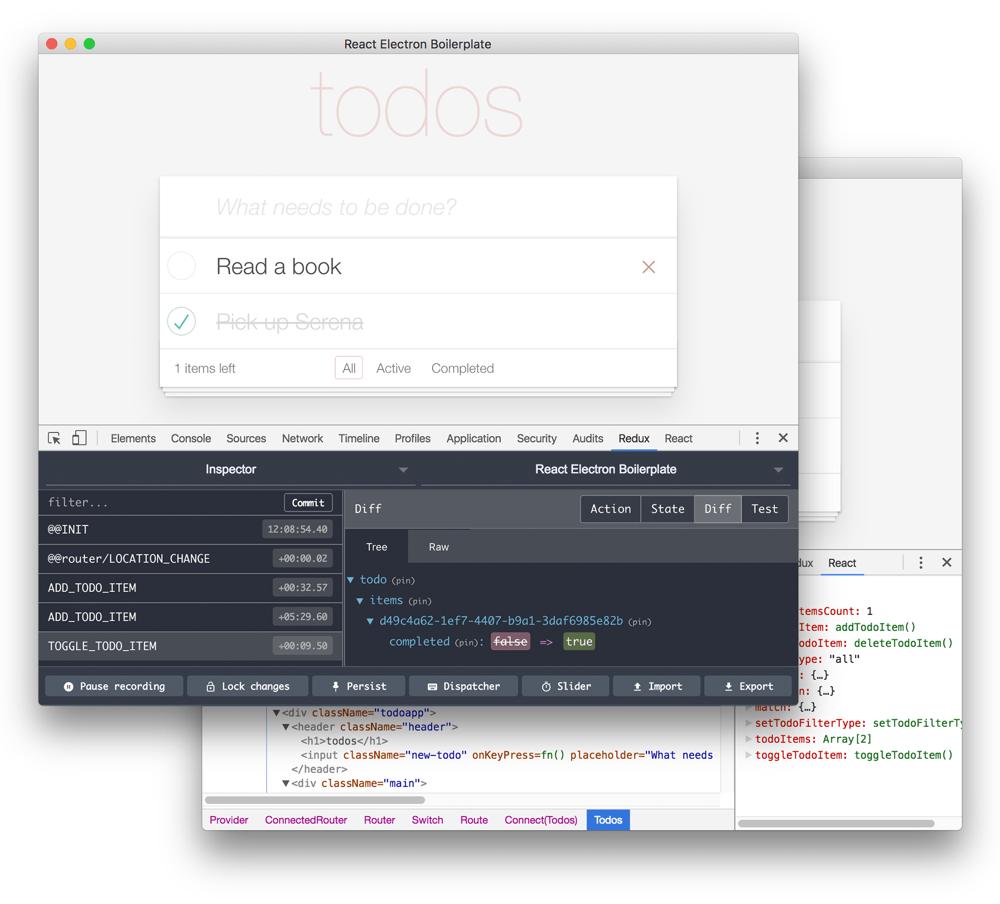
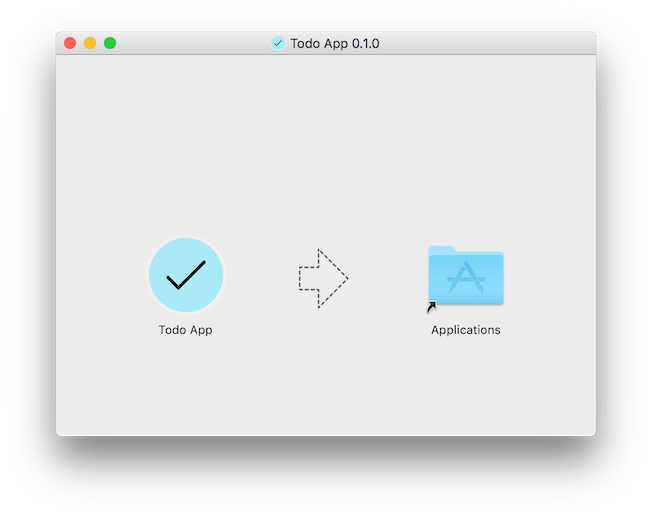

# React Electron Boilerplate

[](https://david-dm.org/jeantimex/react-electron-boilerplate)
[](https://david-dm.org/jeantimex/react-electron-boilerplate?type=dev)
[](https://travis-ci.org/jeantimex/react-electron-boilerplate)
[](https://coveralls.io/github/jeantimex/react-electron-boilerplate)


## About

Electron has main process and render process. The main process is responsible for creating and managing BrowserWindow instances and various application events. It can also do things like register global shortcuts, create native menus and dialogs, respond to auto-update events, and more. The render process is responsible for running the user-interface of your app, or in other words, a web page.

React is a really popular JavaScript library for building user interface, and it's perfect for building the web page for Electron.

How to integrate Electron and React? And how to setup the folder structure that helps organize the source codes for both main process and render process? Basically we can put all the source codes related to the main process in `src/main` folder, and those handle render process are in `src/renderer` folder.

We use Webpack to bundle the assets for the main process and render process, respectively. And Jest is used for running tests.

You can use this boilerplate to scaffold your Electron project, it has a Todo list app that shows your how to use React with Redux and Ract Router, it supports localization as well, or feel free to use this project as a reference.

## Features

**Quick scaffolding**<br />
Save your time in putting Electron, React, Redux, Router, Webpack, Jest and localization together, so you can focus on coding your awesome desktop application.

**Basic react eco system**<br />
The scaffolded project will include the latest React, Redux, React Router and React Intl.

**Installer distribution**<br/>
We use [Electron Builder](https://github.com/electron-userland/electron-builder) and its [two package.json structure](https://github.com/electron-userland/electron-builder/wiki/Two-package.json-Structure).

- [Link](https://github.com/electron-userland/electron-builder/blob/master/docs/Multi%20Platform%20Build.md) for prerequisites of generating installers on different platforms.
- [Link](https://github.com/electron-userland/electron-builder/wiki/Code-Signing) for code signing.

**Webpack 2**<br />
Enjoy the tree shaking feature in Webpack 2.

**Jest**<br />
Facebook's painless JavaScript test runner, no need to configure Karma Webpack, no need to use Sinon and Babel Rewire.

## Quick start

**Get up and running**<br />
1. Clone this repo using `git clone https://github.com/jeantimex/react-electron-boilerplate.git`
2. Run `yarn` or `npm install` to install the dependencies
3. Run `yarn dev` or `npm run dev` to see the example electron app

<br />

4. Run `yarn run test` to trigger eslint, jest with coverage report
```
 PASS  tests/renderer/components/todos/Todos.spec.js
 PASS  tests/renderer/reducers/TodoReducer.spec.js
 PASS  tests/renderer/actions/index.spec.js

Test Suites: 3 passed, 3 total
Tests:       24 passed, 24 total
Snapshots:   0 total
Time:        2.728s
Ran all test suites.
------------------|----------|----------|----------|----------|----------------|
File              |  % Stmts | % Branch |  % Funcs |  % Lines |Uncovered Lines |
------------------|----------|----------|----------|----------|----------------|
All files         |      100 |    86.36 |      100 |      100 |                |
 components/todos |      100 |       80 |      100 |      100 |                |
  Todos.js        |      100 |       80 |      100 |      100 |    109,117,125 |
 reducers         |      100 |      100 |      100 |      100 |                |
  TodoReducer.js  |      100 |      100 |      100 |      100 |                |
------------------|----------|----------|----------|----------|----------------|
```

**Build platform installer**<br />
- Mac: Run `yarn run pack:mac`
- Windows: Run `yarn run pack:win`
- Linux: Run `yarn run pack:linux`
- All platforms: Run `yarn run pack`

Here is an example of launching the dmg file on Mac:



## Documents

- [Electron](docs/electron.md)
  - [Folder structure](docs/electron.md)
  - [Electron Builder](docs/electron.md)
- [Babel](docs/babel.md)
- [React](docs/react.md)
  - [Redux](docs/redux.md)
  - [Router](docs/react-router.md)
  - [Localization](docs/react-intl.md)
- [Webpack](docs/webpack.md)
- [Unit Testing](docs/jest.md)

## License

This project is licensed under the MIT license, Copyright (c) 2017 Yong Su. For more information see `LICENSE.md`.
